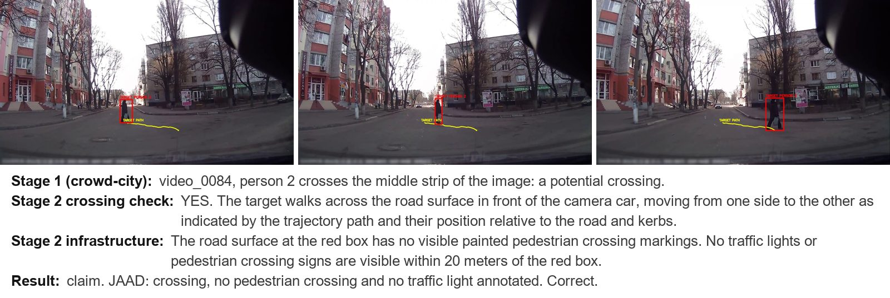
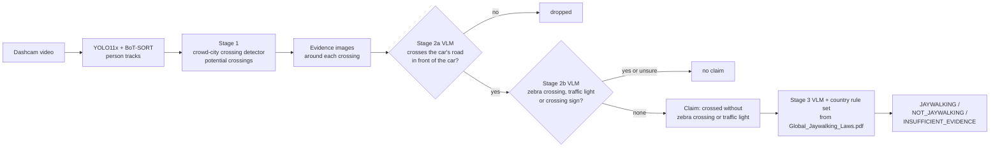
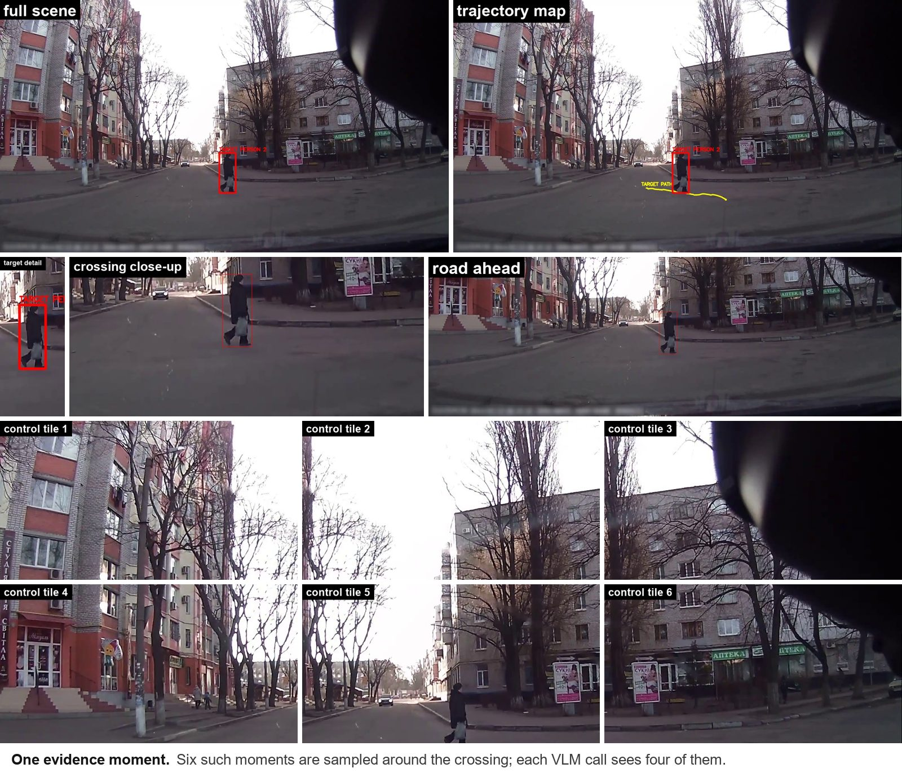
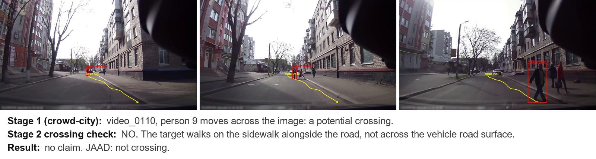
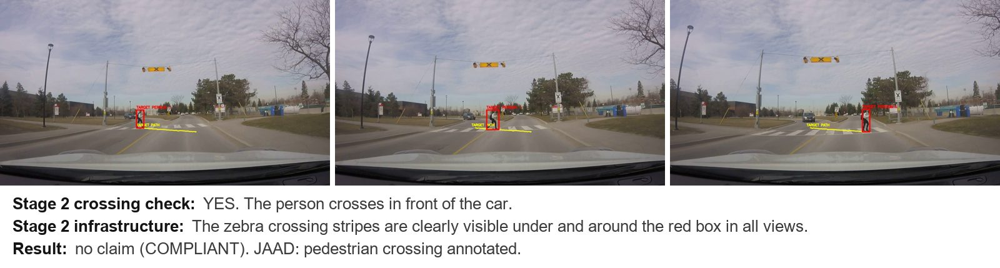
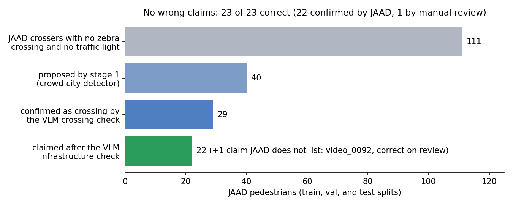

# CROWD Jaywalking

Finding pedestrians in dashcam video who cross the road **without a zebra crossing and without a traffic light**, and deciding, with each country's own law, whether that is **jaywalking**.

The target is the [CROWD dataset](https://github.com/crowd-dataset/crowd): about 32,600 hours of dashcam footage from 238 countries. Nobody can check that much video by hand, so the method is built so that its positive claims can be trusted without a human verifier, and it is measured against the [JAAD](https://github.com/ykotseruba/JAAD) dataset, which has per pedestrian crossing labels.



*Every image in this README is real pipeline output on JAAD. The red box is the tracked person, the yellow line the path of their feet.*

## Contents

* [How it works](#how-it-works)
* [What the VLM sees](#what-the-vlm-sees)
* [How it is evaluated](#how-it-is-evaluated)
* [Results](#results)
* [Setup](#setup)
* [Running](#running)
* [Configuration reference](#configuration-reference)
* [Outputs](#outputs)
* [Earlier designs](#earlier-designs)
* [Limitations](#limitations)
* [Repository structure](#repository-structure)

## How it works



Each stage answers one question, and a claim needs every stage to agree. Any doubt means no claim.

1. **Stage 1: potential crossings, from bounding boxes only.** YOLO11x detects people and BoT-SORT (`configs/botsort.yaml`, identical to crowd-city's tracker) follows them. The crossing detector of [crowd-city](https://github.com/crowd-dataset/crowd-city) (`crowd_city_detection.py`, an unchanged copy) proposes a person as a potential crossing when their track passes from one side of a narrow strip in the middle of the image to the other and survives its motion, rider, and camera motion filters. It was checked to give identical output to crowd-city on all 323 JAAD videos. Only these snippets go further: the VLM never sees the full footage.
2. **Stage 2: the VLM checks the snippet** (Qwen3-VL-8B-Instruct).
   * **Crossing check** (prompt `v3`): does the person walk across the road the camera car is driving on, in front of the car? Crossing a side street or another road is not of interest. Only a clear YES continues.
   * **Infrastructure check** (prompt `zebra_light_v5`): is there a zebra crossing, a traffic light, or a pedestrian crossing sign? This prompt never judges the person. A fixed policy then requires every infrastructure answer to be NO, for this person and for every other crossing person in the clip.
3. **Stage 3: the law.** Whether such a crossing is jaywalking depends on the country. A separate step (`scripts/law/run_jaywalking_law.py`) retrieves the rule set of the video's country from `Global_Jaywalking_Laws.pdf` (51 countries), asks the VLM YES, NO, or UNKNOWN on each numbered condition, and computes the label from the rule set's decision rule. The model never chooses the label.

## What the VLM sees

For every accepted crossing, six moments are sampled from the crossing itself plus half a second either side. Each moment is turned into several views, so that small markings, signals, and signs are visible at near full resolution. Each VLM call sees four of the six moments.



* **Full scene** and **trajectory map** (the path of the feet as a yellow line): used by the crossing check and stage 3.
* **Target detail**: a close-up of the person.
* **Crossing close-up** and **road ahead**: full resolution crops of the road around the feet, used for zebra crossings.
* **Control tiles**: six overlapping crops of the upper scene, used for traffic lights and crossing signs.

A person stage 1 proposed, but who only walks along the pavement, is dropped by the crossing check:



A real crossing at a zebra crossing is stopped by the infrastructure check:



Stage 3 output for one claim (from `jaywalking_law/verdicts.jsonl`):

```json
{"video_id": "video_0084", "person_id": 2, "country": "CAN", "label": "JAYWALKING",
 "reason": "All required conditions met",
 "verdicts": {"CAN-R1": "YES", "CAN-R2": "YES", "CAN-R3": "YES"},
 "verdict_sources": {"CAN-R1": "vlm", "CAN-R2": "pipeline", "CAN-R3": "vlm"},
 "evidence_summary": "CAN-R1: The pedestrian is on a public road ... CAN-R3: The pedestrian crosses outside a designated crossing ...",
 "legal_basis": "Illegal (Provincial Highway Traffic Acts)"}
```

## How it is evaluated

The claim the method makes ("this person crossed without a zebra crossing and without a traffic light") must be true every time, so the evaluation measures **the precision of the claims** and how many real cases they find.

`scripts/jaad/run_jaad_person_audit.py` runs stages 1 and 2 over the saved tracks of a JAAD split and matches every claimed person to a JAAD pedestrian (box overlap of at least `jaad_match_iou` on at least `jaad_min_match_frames` frames). A claim is

* **confirmed** when that pedestrian has a JAAD crossing label and JAAD's per frame scene annotations mark no pedestrian crossing (`ped_crossing`) and no traffic light on its crossing frames,
* **wrong** when JAAD says the pedestrian is not crossing, or marks a pedestrian crossing or traffic light,
* **unverifiable** when the person is a JAAD bystander without behaviour labels, or no JAAD pedestrian. Unverifiable claims count as wrong, so the reported precision is a lower bound.

**Eligible crossers** are the JAAD pedestrians the method should find: crossing, with no pedestrian crossing and no traffic light on their crossing frames. Recall is confirmed claims over eligible crossers. The precision is reported with a one sided 95% Clopper-Pearson lower bound, because with few claims "100%" alone says little.

Claims that JAAD cannot settle were reviewed by hand and recorded in `data/claim_review.csv`.

## Results

On all three JAAD splits (train, val, and test; 309 videos):



| JAAD split | Claims | Correct | Eligible crossers found |
| --- | ---: | ---: | ---: |
| Test (117 videos) | 8 | 8 | 7 of 39 |
| Train (165 videos) | 13 | 13 | 13 of 65 |
| Val (27 videos) | 2 | 2 | 2 of 7 |
| **All** | **23** | **23** (95% lower bound 87.8%) | **22 of 111 (20%)** |

* 22 claims are confirmed by JAAD. The 23rd (`video_0092`) JAAD marks as "traffic light in view", but the light is far from where the person crosses; manual review: correct.
* Most eligible crossers are lost in stage 1: the crowd-city detector, which only sees bounding boxes, proposes 40 of the 111. The VLM crossing check then rejects some real crossers as "walking along the pavement".
* The crossing check prompt (`v3`) was chosen after the test split had been inspected, so the test split is no longer a clean held-out set.
* Stage 3 on the same 23 claims, applying three countries' rules: all `JAYWALKING` under Canada and Ukraine (crossing outside a designated crossing), all `NOT_JAYWALKING` under Australia (no crossing within 20 metres, so crossing there is lawful). JAAD has no per video country, so this checks that the rules are applied, not legal correctness.

## Setup

All commands run from the repository root (PowerShell on Windows; the same commands work in a Linux shell with `/` paths).

### 1. Install

```powershell
uv sync
uv run python -c "import torch; print(torch.__version__, torch.cuda.is_available())"
```

`pyproject.toml` installs PyTorch from the CUDA 12.8 wheel index (needed for RTX 50 series GPUs). A CPU build works but the VLM is about 25 times slower. Model weights (YOLO11x, Qwen3-VL-8B, about 17 GB) download on first use; set `HF_HOME` or `vlm_cache_dir` to keep the Hugging Face cache on another drive.

### 2. Configuration and secrets

The project follows the CROWD repositories' convention: `default.config` is the committed template with every setting, and `config` is your local copy (ignored by Git). Settings are read with `common.get_configs`, credentials with `common.get_secrets`, and logging goes through `custom_logger.CustomLogger` at `logger_level`.

```powershell
Copy-Item .\default.config .\config
Copy-Item .\default.secret .\secret      # only for downloading CROWD videos
```

Edit `config` for paths and experiments. When `default.config` gains settings, add them to `config` too: a `config` with fewer entries than `default.config` stops the run. `secret` holds `ftp_username`, `ftp_password`, and optionally `ftp_token` for the CROWD file server. Every setting is described in the [configuration reference](#configuration-reference).

### 3. Data

* **JAAD**: `.\scripts\jaad\download_jaad.ps1` downloads the JAAD 2.0 annotations and all 346 clips into `data/JAAD`.
* **CROWD**: `mapping.csv` lists every CROWD source video, its segments, city, state, and country. Videos are taken from the `videos` folders or downloaded from the file server into `crowd_download_dir`.
* **Jaywalking laws**: `data/Global_Jaywalking_Laws.pdf`, converted into `configs/jaywalking_rules.json` (committed).

## Running

| Step | Command | Notes |
| --- | --- | --- |
| Unit tests | `uv run python -m unittest discover -s tests` | No GPU or model weights needed |
| Track JAAD | `uv run python -u .\scripts\jaad\run_jaad_crossing_benchmark.py` | Once per `jaad_benchmark_split` (`train`, `val`, `test`); saves tracks to `jaad_benchmark_results` |
| Stages 1 and 2 on JAAD, with the audit | `uv run python -u .\scripts\jaad\run_jaad_person_audit.py` | Split from `jaad_audit_split`; resumes after an interruption |
| Stages 1 and 2 on CROWD | `uv run python -u .\scripts\crowd\run_crowd_analysis.py` | `crowd_max_segments` or `crowd_video_id` limit the run |
| Stage 3 (law) | `uv run python .\scripts\law\run_jaywalking_law.py <results folder>` | CROWD takes the country from `mapping.csv`; for JAAD add `--country CAN` (repeatable) |
| One video | `uv run python .\scripts\evaluation\run_one_video.py` | Set `smoke_test_video` first |
| Rebuild the law rules | `uv run python .\scripts\law\build_jaywalking_rules.py data\Global_Jaywalking_Laws.pdf configs\jaywalking_rules.json` | After an updated PDF; then rerun stage 3 only. Needs `pdftotext` (poppler) |
| README figures | `uv run python .\scripts\docs\make_readme_figures.py` | From the evidence of the configured `results` run |

Stage 3 runs separately from stages 1 and 2, so it can use a different model (`jaywalking_law_model`) without sharing GPU memory, and it can be rerun when the law rules change without rerunning the rest. The United States conditions come from the location: Texas and Florida enforce, New York City is decriminalised, California needs an immediate collision hazard (`USA-R4`), and any other state stays UNKNOWN, as the rule set requires. Ireland, New Zealand, Sweden, and the United Kingdom have no offense; Greece, India, Mexico, Nigeria, Pakistan, and Zimbabwe have no specified conditions; countries without a rule set are recorded as `NO_RULE_SET`. The rule sets cover 51 of the 238 CROWD countries and 87.6% of its hours.

Tools from the earlier designs are still available: `scripts/crossing/train_jaad_crossing_classifier.py`, `scripts/crossing/evaluate_jaad_crossing_classifier.py`, `scripts/crossing/train_crossing_gate.py`, `scripts/jaad/compute_jaad_camera_motion.py`, `scripts/evaluation/prepare_splits.py`, `scripts/evaluation/run_evaluation.py`, `scripts/evaluation/diagnose_evaluation.py`, `scripts/context/prepare_jaad_context.py`, `scripts/context/run_jaad_context_benchmark.py`, and `scripts/context/compare_jaad_context_models.py` (see [Earlier designs](#earlier-designs)).

## Configuration reference

Every entry of `default.config`. Paths are relative to the repository root unless absolute. `null` means unset. Fractions of the image are of its width (x) or height (y). Durations in seconds are converted to frames at the video's frame rate.

### Paths, logging, and run selection

| Setting | Default | Meaning and allowed values |
| --- | --- | --- |
| `data` | `["data"]` | Folders searched for the human annotation CSVs. List of paths |
| `videos` | `["data/videos"]` | Folders searched for videos (the labelled JAAD evaluation clips, and local CROWD source videos before downloading). List of paths |
| `results` | `"results/jaad_crowd_city_vlm_v3"` | Output folder of JAAD runs (audit, evaluation, smoke test). A new folder per experiment |
| `resume` | `true` | Skip videos whose results are already saved. `true` or `false` |
| `logger_level` | `"info"` | Console log level: `"debug"`, `"info"`, `"warning"`, `"error"` |
| `jaad_audit_split` | `"test"` | JAAD split audited by `scripts/jaad/run_jaad_person_audit.py`: `"train"`, `"val"`, `"test"` |
| `smoke_test_video` | `""` | Video path for `scripts/evaluation/run_one_video.py` |
| `crowd_video_id` | `""` | Process only this CROWD source video ID; `""` processes all |
| `jaad_video_id` | `""` | Process only this JAAD video (for example `"video_0084"`); `""` processes the split |

### Tracking

| Setting | Default | Meaning and allowed values |
| --- | --- | --- |
| `tracking_model` | `"yolo11x.pt"` | Ultralytics detector weights. `yolo11x.pt` matches the precomputed CROWD tracks; `yolo26x.pt` was used by the earlier designs |
| `bbox_tracker` | `"configs/botsort.yaml"` | BoT-SORT tracker settings (2 s track buffer, ReID) |
| `min_confidence` | `0.0` | Detection confidence passed to the tracker, 0 to 1. Stage 1 itself keeps boxes with confidence of at least 0.7, as crowd-city does |
| `iou` | `0.7` | Non maximum suppression IoU threshold of the detector, 0 to 1 |
| `device` | `null` | Tracking device: `null` (automatic), `"cpu"`, `"cuda"`, `"cuda:0"`, ... |

### Crossing decision

| Setting | Default | Meaning and allowed values |
| --- | --- | --- |
| `crossing_decision_mode` | `"crowd_city"` | How stage 1 decides crossings. `"crowd_city"`: crowd-city's detector (current method). `"classifier"`: the JAAD trained classifier and gate below. `"rules"`: this project's own rule detector (the corridor settings below) |
| `crossing_vlm_check` | `true` | Ask the VLM whether each candidate really crosses; only a clear YES continues. `true` or `false` |
| `crossing_vlm_check_version` | `"v3"` | Crossing check prompt. `"v1"`: crosses any carriageway. `"v2"`: whole-track wording. `"v3"`: crosses the camera car's road, in front of the car |
| `crossing_rescue_min_first_stage` | `null` | Classifier mode only: also send first stage rejections with at least this probability to the VLM crossing check. Number 0 to 1, or `null` (off). Set together with `crossing_rescue_min_gate` |
| `crossing_rescue_min_gate` | `null` | Minimum gate probability for a rescued track. Number 0 to 1, or `null` |

### Classifier mode (`crossing_decision_mode: "classifier"`)

| Setting | Default | Meaning and allowed values |
| --- | --- | --- |
| `crossing_classifier_model` | `"results/jaad_crossing_classifier_yolo11x/crossing_classifier.joblib"` | Trained first stage classifier |
| `crossing_classifier_results` | `"results/jaad_crossing_classifier_yolo11x"` | Output folder of `scripts/crossing/train_jaad_crossing_classifier.py` |
| `crossing_classifier_min_precision` | `0.9` | Training picks the threshold with at least this cross validated precision, 0 to 1 |
| `crossing_classifier_cv_folds` | `5` | Grouped cross validation folds (integer, at least 2) |
| `crossing_classifier_threshold_step` | `0.01` | Step of the threshold search, 0 to 1 |
| `crossing_classifier_random_seed` | `42` | Random seed (integer) |
| `crossing_classifier_logistic_c_values` | `[0.1, 1.0, 10.0]` | Logistic regression regularisation values tried |
| `crossing_classifier_gradient_learning_rates` | `[0.05, 0.1]` | Gradient boosting learning rates tried |
| `crossing_classifier_gradient_max_leaf_nodes` | `[7, 15]` | Gradient boosting leaf counts tried |
| `crossing_classifier_fallback_to_rules` | `false` | Use the rule detector when the classifier file is missing (`true`), or stop (`false`) |
| `crossing_classifier_min_track_frames` | `5` | Shortest track scored by the classifier (frames) |
| `crossing_gate_model` | `"results/jaad_crossing_gate_yolo11x/crossing_gate.joblib"` | High precision gate that must also accept a classifier crossing. `null` disables it |
| `crossing_gate_results` | `"results/jaad_crossing_gate_yolo11x"` | Output folder of `scripts/crossing/train_crossing_gate.py` |
| `crossing_gate_min_precision` | `0.95` | Gate tier used at inference; must be one of `crossing_gate_precision_tiers` |
| `crossing_gate_precision_tiers` | `[0.98, 0.95, 0.9]` | Precision tiers the gate threshold is fitted for; each person records the strictest tier it meets |
| `crossing_gate_min_accepted` | `30` | Fewest training tracks a tier must accept (integer) |
| `crossing_gate_cv_folds` | `5` | Grouped cross validation folds of the gate |
| `crossing_gate_learning_rate` | `0.05` | Gate gradient boosting learning rate |
| `crossing_gate_max_leaf_nodes` | `15` | Gate gradient boosting leaf count |
| `crossing_gate_random_seed` | `42` | Gate random seed |
| `crossing_gate_camera_motion` | `true` | Train and run the gate with camera compensated motion (BoT-SORT's GMC removed from the foot path). `true` or `false` |
| `crossing_min_scene_x_range` | `0.2` | Classifier mode: minimum sideways motion relative to the scene, as a fraction of the image width; `null` disables the rule |

### Rule detector and track features (`"rules"` and `"classifier"` modes)

These settings describe the road corridor and the filters of this project's own rule detector, whose measurements are also features of the classifier. The `"crowd_city"` mode uses crowd-city's built-in values instead.

| Setting | Default | Meaning and allowed values |
| --- | --- | --- |
| `road_left`, `road_right` | `0.45`, `0.55` | Left and right edge of the road corridor at the feet, fractions of the image width |
| `boundary_tolerance` | `0.0` | Margin added to the corridor edges, fraction of the width |
| `perspective_corridor_enabled` | `true` | Use a trapezoid corridor that widens towards the camera instead of the straight strip |
| `road_top_y`, `road_bottom_y` | `0.35`, `1.0` | Image heights (fraction) of the top and bottom of the trapezoid |
| `road_top_left`, `road_top_right` | `0.45`, `0.55` | Corridor edges at `road_top_y` |
| `road_bottom_left`, `road_bottom_right` | `0.3`, `0.7` | Corridor edges at `road_bottom_y` |
| `min_track_seconds` | `0.33` | Shortest track considered |
| `min_road_seconds` | `0.1` | Shortest time inside the corridor |
| `max_track_gap_seconds` | `1.0` | A longer gap splits one tracker ID into separate tracks |
| `partial_crossing_enabled` | `true` | Accept a track that enters the corridor from one side and leaves the view before reaching the other side |
| `partial_exit_min_x_range` | `0.38` | Minimum sideways travel of such a partial crossing, fraction of the width |
| `partial_exit_min_direction_consistency` | `0.85` | Minimum share of motion in one direction for a partial crossing, 0 to 1 |
| `strong_complete_override_enabled` | `true` | Let long, wide, consistent crossings bypass the weak track filters |
| `strong_complete_min_seconds` | `4.0` | Minimum duration of such a strong crossing |
| `strong_complete_min_x_range` | `0.45` | Minimum sideways travel of a strong crossing |
| `strong_complete_min_direction_consistency` | `0.85` | Minimum direction consistency of a strong crossing, 0 to 1 |
| `min_crossing_x_range` | `0.14` | Minimum sideways travel of any crossing |
| `max_crossing_speed_per_frame` | `null` | Reject faster sideways motion (fraction of the width per frame); `null` means no limit |
| `low_x_range`, `low_x_min_road_seconds` | `0.3`, `0.67` | A crossing with less travel than `low_x_range` needs at least this time in the corridor |
| `weak_x_range`, `long_weak_road_seconds` | `0.64`, `3.0` | A crossing with less travel than `weak_x_range` that stays longer than this in the corridor is rejected as loitering |
| `weak_y_jitter_x_range`, `weak_y_jitter_motion`, `weak_y_jitter_height` | `0.5`, `0.3`, `0.22` | Reject small tracks (height below the last value) with little sideways travel and a lot of vertical jitter |
| `jitter_road_seconds` | `1.333333` | Time in the corridor after which vertical jitter also rejects wider crossings (below `large_lateral_x_range`) |
| `tiny_long_track_x_range`, `tiny_long_track_height`, `tiny_long_track_road_seconds` | `0.36`, `0.12`, `1.666667` | Reject tiny, distant boxes with little travel that stay long in the corridor |
| `tiny_no_static_height`, `tiny_no_static_width`, `tiny_no_static_min_road_seconds` | `0.12`, `0.026`, `0.333333` | Reject tiny boxes when no static objects are available to check camera motion |
| `no_static_tiny_min_road_seconds`, `no_static_tiny_fast_speed` | `0.166667`, `0.006` | Shortest corridor time and fastest sideways speed allowed for such tiny boxes |
| `slender_track_width`, `slender_track_height` | `0.05`, `0.26` | Boxes narrower and shorter than these count as slender (often poles or partial detections) |
| `slender_track_min_road_seconds`, `slender_track_max_road_seconds` | `0.166667`, `1.633333` | Corridor time range in which slender boxes are checked |
| `no_static_slender_height`, `no_static_slender_max_road_seconds` | `0.24`, `0.666667` | Slender boxes without static references: maximum height and corridor time |
| `slender_static_min_relative_x_range` | `0.13` | Minimum motion of a slender box relative to static objects |
| `large_lateral_x_range`, `large_lateral_tiny_height` | `0.56`, `0.105` | Reject very wide travel by a very small box (usually a tracking mix-up) |
| `min_static_shared_seconds` | `0.27` | Shortest overlap with static objects (traffic lights, signs, hydrants, benches: YOLO classes 9 to 13) for a camera motion check |
| `camera_static_x_range` | `0.25` | Static objects moving at least this far sideways mean the camera itself turns |
| `camera_ratio_threshold` | `0.6` | Ratio of static to person motion above which the person's motion is attributed to the camera |
| `camera_min_shared_track_ratio` | `0.25` | Share of the person's frames that must overlap a static object for that check |
| `camera_static_relative_x_range`, `camera_static_height` | `0.18`, `0.15` | While the camera moves: reject small boxes moving less than this relative to static objects |
| `camera_static_tiny_relative_x_range`, `camera_static_tiny_height` | `0.12`, `0.19` | The same check for tiny boxes |
| `camera_tiny_height`, `camera_min_road_seconds` | `0.15`, `0.166667` | While the camera moves: reject boxes below this height that spend at least this time in the corridor |
| `min_relative_x_range` | `0.01` | Minimum person motion relative to static objects for any crossing |
| `rider_min_shared_seconds`, `rider_min_continuous_shared_seconds`, `rider_shared_run_gap_seconds` | `0.133333`, `0.4`, `0.066667` | A person sharing at least this time (and this long continuously, allowing short gaps) with a bicycle, motorcycle, or vehicle box may be a rider |
| `rider_min_vehicle_width_ratio`, `rider_min_vehicle_width_ratio_frames` | `0.5`, `0.65` | The vehicle must be at least this wide relative to the person, on at least this share of the frames |
| `rider_distance_relative_threshold`, `rider_proximity_ratio` | `0.8`, `0.7` | Person and vehicle centres closer than this (in person heights) on at least this share of frames |
| `rider_alpha_x`, `rider_beta_y`, `rider_gamma_y` | `0.75`, `0.08`, `1.4` | Window, in person widths and heights, where the vehicle must sit relative to the person |
| `rider_colocation_ratio` | `0.7` | Share of shared frames in that window that marks a rider |
| `rider_similarity_threshold`, `rider_similarity_ratio`, `rider_min_motion_seconds`, `rider_motion_colocation_min` | `0.4`, `0.5`, `0.1`, `0.5` | Motion similarity test: person and vehicle moving in the same direction (cosine above the threshold) on enough frames also marks a rider |
| `rider_short_shared_seconds`, `rider_short_similarity_ratio`, `rider_short_displacement` | `0.266667`, `0.8`, `0.12` | Stricter test for short overlaps |

### Evidence images

| Setting | Default | Meaning and allowed values |
| --- | --- | --- |
| `evidence_sample_positions` | `[0.0, 0.2, 0.4, 0.6, 0.8, 1.0]` | Moments sampled across the evidence window, as fractions of it |
| `evidence_context_seconds` | `0.5` | Seconds added before and after the crossing |
| `evidence_infrastructure_span` | `"transition"` | Window of the infrastructure check: `"transition"` (the crossing) or `"track"` (the whole track). `"track"` gave no improvement on JAAD |
| `evidence_crop_margin` | `0.75` | Margin around the person in the target detail view, as a fraction of the box size |
| `evidence_max_dimension` | `1280` | Longest side of the saved views, in pixels |
| `evidence_jpeg_quality` | `90` | JPEG quality of the saved views, 1 to 100 |
| `evidence_trajectory_enabled` | `true` | Draw the yellow foot path in the trajectory map |
| `evidence_road_crop_margin` | `0.12` | Margin of the road area crop around the path, fraction of the image |
| `evidence_control_crop_bottom` | `0.78` | The control tiles cover the image above this height (fraction from the top) |
| `evidence_control_crop_overlap` | `0.2` | Overlap between neighbouring control tiles, 0 to 1 |

### VLM

| Setting | Default | Meaning and allowed values |
| --- | --- | --- |
| `vlm_model` | `"Qwen/Qwen3-VL-8B-Instruct"` | Hugging Face model for stage 2. Qwen2.5-VL, Qwen3-VL, Qwen3.5, and Gemma vision models are supported |
| `vlm_prompt_mode` | `"zebra_light_v5"` | Infrastructure prompt: `"zebra_light_v5"` (current: infrastructure only, never judges the person), `"zebra_light_v1"` to `"zebra_light_v4"`, `"baseline_v3"`, `"focused_v5"` |
| `vlm_device_map` | `"auto"` | Accelerate device placement: `"auto"`, `"cuda"`, `"cpu"` |
| `vlm_torch_dtype` | `"auto"` | `"auto"`, `"bfloat16"`, `"float16"`, `"float32"` |
| `vlm_attn_implementation` | `null` | `null` (default), `"sdpa"`, `"flash_attention_2"`, `"eager"` |
| `vlm_cache_dir` | `null` | Hugging Face cache folder; `null` uses the normal cache |
| `vlm_local_files_only` | `false` | `true` never downloads weights |
| `vlm_min_pixels`, `vlm_max_pixels` | `200704`, `250880` | Pixel budget per image. 250880 keeps one call within 32 GB of VRAM; lower it on smaller GPUs (calls that spill into shared memory on Windows become tens of times slower) |
| `vlm_max_new_tokens` | `300` | Longest answer |
| `vlm_task_max_frames` | `4` | Moments sent per VLM call |
| `vlm_quantization` | `null` | `"4bit"` loads larger models with bitsandbytes; `null` loads full precision |

### Decision policy

| Setting | Default | Meaning and allowed values |
| --- | --- | --- |
| `permission_cues` | `["marked_crosswalk", "permissive_pedestrian_signal", "traffic_light"]` | Visible cues that make a crossing compliant. Any of `"marked_crosswalk"`, `"permissive_pedestrian_signal"`, `"traffic_light"`, `"authorised_crossing_sign"`, `"crossing_guard_permission"` |
| `context_scope` | `"scene"` | `"scene"`: a cue seen for any crossing person in the clip counts for every crossing person. `"person"`: only that person's own evidence |
| `strict_absence` | `true` | A claim needs every infrastructure answer (zebra, traffic light, signals, crossing sign, crossing guard) to be NO for every crossing person in the clip; any YES or UNCERTAIN gives `UNCERTAIN` |
| `partial_visibility_uncertain` | `false` | `true` turns partial visibility with no visible permission into `UNCERTAIN` |
| `prohibitive_signal_overrides_crosswalk` | `false` | `true` labels crossing on a red or "do not walk" signal as jaywalking even at a crosswalk. Off, because a red light means a traffic light is present |

### Stage 3: country law

| Setting | Default | Meaning and allowed values |
| --- | --- | --- |
| `jaywalking_law_rules` | `"configs/jaywalking_rules.json"` | Rule sets built from the PDF by `scripts/law/build_jaywalking_rules.py` |
| `jaywalking_law_model` | `null` | Hugging Face model for stage 3; `null` uses `vlm_model` |
| `jaywalking_law_country` | `null` | Country for runs without location metadata (JAAD): ISO alpha-3 code or name, for example `"CAN"`, `"Ukraine"`. CROWD segments always use their own `mapping.csv` country |
| `jaywalking_law_state` | `null` | State or province with it (matters for the United States, for example `"TX"`) |
| `jaywalking_law_locality` | `null` | City with it (for example `"New York"`) |

### JAAD

| Setting | Default | Meaning and allowed values |
| --- | --- | --- |
| `jaad_root` | `"data/JAAD"` | JAAD 2.0 folder (annotations and `JAAD_clips`) |
| `jaad_benchmark_split` | `"train"` | Split tracked by `scripts/jaad/run_jaad_crossing_benchmark.py`: `"train"`, `"val"`, `"test"` |
| `jaad_benchmark_results` | `"results/jaad_yolo11x"` | Saved JAAD tracks per split (and `camera_motion/`) |
| `jaad_match_iou` | `0.5` | Box overlap that matches a track to a JAAD pedestrian, 0 to 1 |
| `jaad_min_match_frames` | `5` | Frames that must overlap for a match |
| `jaad_min_track_coverage` | `0.1` | Share of a JAAD pedestrian's frames a track must cover in the crossing benchmark, 0 to 1 |
| `jaad_context_split` | `"train"` | Split of the VLM context benchmark: `"train"`, `"val"` (selection refuses `"test"`) |
| `jaad_context_results` | `"results/jaad_context_audit_v5"` | Output folder of the context benchmark |
| `jaad_context_sample_size` | `120` | Crossing events sampled for manual context labels; `0` uses all |
| `jaad_context_sampling_seed` | `42` | Seed of that sample |

### Labelled video evaluation (earlier designs)

| Setting | Default | Meaning and allowed values |
| --- | --- | --- |
| `source_annotations` | `"annotations.csv"` | Human video labels (`video_id,filename,label`, label `Yes`, `No`, or other) |
| `annotations` | `"annotations_with_splits.csv"` | The same labels with frozen splits, written by `scripts/evaluation/prepare_splits.py` |
| `evaluation_split` | `"development"` | Split evaluated by `scripts/evaluation/run_evaluation.py`: `"development"`, `"validation"`, `"locked_test"` |
| `split_seed` | `42` | Seed of the stratified split |
| `development_fraction`, `validation_fraction`, `locked_test_fraction` | `0.6`, `0.2`, `0.2` | Split sizes; must add up to 1 |
| `vlm_comparison_models` | `["Qwen/Qwen3-VL-8B-Instruct", "google/gemma-4-12B-it"]` | Models compared by `scripts/context/compare_jaad_context_models.py` |
| `vlm_comparison_prompt_modes` | `["baseline_v3", "focused_v5"]` | Prompt modes compared |
| `vlm_comparison_results` | `"results/jaad_vlm_comparison_v5"` | Output folder of the comparison |

### CROWD

| Setting | Default | Meaning and allowed values |
| --- | --- | --- |
| `mapping` | `"mapping.csv"` | CROWD mapping: source videos, segments, time of day, city, state, ISO country code |
| `ftp_server` | `"https://files.mobility-squad.com/"` | CROWD file server; credentials come from `secret` |
| `crowd_ftp_aliases` | `["tue4", "tue5"]` | Server folders searched for a video |
| `crowd_results` | `"results/crowd_jaywalking"` | Output folder of `scripts/crowd/run_crowd_analysis.py` |
| `crowd_resume` | `true` | Skip segments already processed |
| `crowd_download_dir` | `"data/crowd_downloads"` | Where downloaded source videos are kept |
| `crowd_download_timeout_seconds` | `20` | Server request timeout |
| `crowd_download_max_pages` | `500` | Most server index pages crawled to find a video |
| `crowd_trim_end_margin_seconds` | `1.0` | Seconds cut from the end of a segment (the mapping's end times can overrun the video) |
| `crowd_delete_downloaded_base_videos` | `false` | Delete a source video once its segments are processed |
| `crowd_keep_segment_videos` | `true` | Keep the cut segment videos |
| `crowd_max_segments` | `0` | Process at most this many segments; `0` processes all |
| `crowd_audit_random_seed`, `crowd_audit_per_stratum` | `42`, `50` | Seed and size per stratum of `audit_sample.csv`, the people sampled for a manual check |

## Outputs

A JAAD audit (`results/<run>/jaad_person_audit_<split>/`):

```text
summary.json            claims, confirmed, precision and its lower bound, eligible crossers, recall
claims.csv              every claimed person and its verdict
details/<video>.json    stage 1 candidates, VLM crossing checks, VLM context, decisions
tracking/<video>.csv    the tracks used
evidence/<video>/person_<id>_transition_<start>_<end>/*.jpg
jaywalking_law/         stage 3: verdicts.jsonl (with every prompt), verdicts.csv, summary.json
```

A CROWD run (`crowd_results`) adds `per_video_results.csv`, `per_person_results.csv` (with the city, state, and country of each segment), `audit_sample.csv`, and `errors.csv`.

## Earlier designs

The current method replaced several designs. Their settings still work, and their results explain the current choices.

| Design | JAAD claims correct | Eligible crossers found | Why it was replaced |
| --- | ---: | ---: | --- |
| Classifier + gate + VLM context (standard profile, YOLO26x) | about 86 to 93% per person | about 50% | Not precise enough for claims that must be correct |
| Tracking-only strict mode: classifier, camera motion aware gate at 95%, scene motion rule, YOLO26x, Mask2Former veto | 31 of 32 (14 of 15 on test) | 28% | Errors were people who only appear to cross (walking towards the car, or the car turning); the classifier was trained on JAAD itself |
| The same with YOLO11x tracks (as in CROWD) | 32 of 34 after review | 28% | Same errors |
| crowd-city + VLM crossing check v1, with a Mask2Former segmentation veto | 9 of 9 | 8% | The veto blocked 11 correct claims to stop one: it mistook snow, slush, and glare for crosswalks and counted traffic lights anywhere in view |
| **crowd-city + VLM crossing check v3, no veto (current)** | **23 of 23** | **20%** | |

To rerun the tracking-only strict mode, set in `config`: `crossing_decision_mode` `"classifier"`, `tracking_model` `"yolo26x.pt"`, `min_confidence` `0.25`, `jaad_benchmark_results` `"results/jaad_v1_5"`, `crossing_classifier_model` `"results/jaad_crossing_classifier_v1/crossing_classifier.joblib"`, `crossing_gate_model` `"results/jaad_crossing_gate_v2/crossing_gate.joblib"`, `crossing_gate_camera_motion` `true`, `crossing_min_scene_x_range` `0.2`, `crossing_gate_min_precision` `0.95`, `crossing_vlm_check` `false`; then run `scripts/jaad/compute_jaad_camera_motion.py` once and `scripts/jaad/run_jaad_person_audit.py`. (The Mask2Former veto it used has been removed from the code.)

The first stage classifier alone, on the official JAAD test split (YOLO26x): track match recall 98.6%, crossing precision 87.7%, recall 81.8%, F1 84.6% (TP 157, TN 62, FP 22, FN 35).

`tools/annotators/jaad_front_crossing_annotator.html` and `tools/annotators/jaad_observable_context_annotator.html` are browser tools used to label which pedestrians cross in front of the car and what context is visible; they store progress in the browser and export CSV files.

## Limitations

* **Recall.** About one in five eligible crossers is found. Stage 1 sees only bounding boxes and misses most crossings that do not pass through the middle of the image.
* **Private property.** In stage 3 the VLM answered "public road" for all 23 JAAD claims, including 9 in JAAD parking lots, so private car parks are not yet excluded reliably.
* **Designated crossings.** These are judged as marked crossings or signals. In some places (for example Ontario) an unmarked intersection is also a legal crossing.
* **Red light crossings** are out of scope: scenes with a traffic light are never claimed, so offenses such as `DEU-T2` cannot be found.
* **The law document.** Distances to an available crossing are unspecified for 29 countries, there is no table of US states, and six countries have no conditions, so many claims there end as `INSUFFICIENT_EVIDENCE`.
* **JAAD labels.** Some contradict each other or the images: per pedestrian attributes can say "designated, signalised" where the per frame annotations and the images show neither, and a traffic light in view is marked even when it is far from the crossing.
* **No country in JAAD.** Stage 3 has only been checked for applying the rules consistently, not for legal correctness on CROWD.
* A malformed VLM answer stops the run with `VLMError` rather than inventing a label.

## Repository structure

```text
.
├── README.md, LICENSE, pyproject.toml, uv.lock
├── default.config                # every setting, with the current method's values
├── config                        # local copy of default.config (ignored by Git)
├── default.secret                # template for secret (CROWD file server credentials)
├── common.py                     # CROWD helpers: get_configs, get_secrets
├── custom_logger.py              # CROWD logger with str.format style messages
├── logmod.py                     # CROWD logging setup (logs)
├── mapping.csv                   # CROWD videos, segments, and locations
├── configs/
│   ├── botsort.yaml              # tracker settings
│   └── jaywalking_rules.json     # 51 country rule sets, from the PDF
├── scripts/                      # all code, by topic: library modules and the scripts that run them
│   ├── core/                     # config, models, pipeline (stages 1 and 2), policy, evidence, tracking, vlm (prompts)
│   ├── crossing/
│   │   ├── crowd_city_detection.py       # crowd-city's crossing detector (unchanged copy)
│   │   ├── crowd_city_crossing.py        # applies it to tracks (stage 1)
│   │   ├── crossing.py, crossing_classifier.py, crossing_gate.py, model_crossing.py,
│   │   │   track_features.py, camera_motion.py   # earlier designs: rule detector, classifier, gate
│   │   └── train_jaad_crossing_classifier.py, evaluate_jaad_crossing_classifier.py, train_crossing_gate.py
│   ├── jaad/
│   │   ├── jaad.py, jaad_benchmark.py, jaad_person_audit.py   # JAAD loading, tracking, audit
│   │   ├── download_jaad.ps1             # JAAD 2.0 annotations and clips into data/JAAD
│   │   ├── run_jaad_crossing_benchmark.py  # tracks JAAD and scores crossing detection
│   │   ├── run_jaad_person_audit.py      # stages 1 and 2 on a JAAD split, with the audit
│   │   └── compute_jaad_camera_motion.py # BoT-SORT camera motion (earlier designs)
│   ├── crowd/
│   │   ├── crowd_source.py, crowd_analysis.py, crowd_tracks.py  # mapping, download, runs, precomputed tracks
│   │   └── run_crowd_analysis.py         # stages 1 and 2 on CROWD
│   ├── law/
│   │   ├── jaywalking_law.py, law_stage.py  # stage 3: rule sets, decision rules, runs over saved claims
│   │   ├── build_jaywalking_rules.py     # PDF -> configs/jaywalking_rules.json
│   │   └── run_jaywalking_law.py         # stage 3 on the saved claims of a run
│   ├── context/                  # earlier designs: VLM context benchmark and model comparison
│   ├── evaluation/               # labelled video evaluation, its diagnosis, and run_one_video.py
│   └── docs/make_readme_figures.py       # the figures in docs/images
├── tests/
├── tools/annotators/             # browser tools for manual labels
├── docs/images/                  # README figures
├── data/                         # JAAD, labels, the law PDF (ignored by Git)
└── results/                      # run outputs (ignored by Git)
```

## Acknowledgements

JAAD frames in `docs/images` are from the [JAAD dataset](https://github.com/ykotseruba/JAAD) (Rasouli, Kotseruba, and Tsotsos), whose video clips are licensed under [CC BY 4.0](http://creativecommons.org/licenses/by/4.0/). The crossing detector is from [crowd-city](https://github.com/crowd-dataset/crowd-city).
